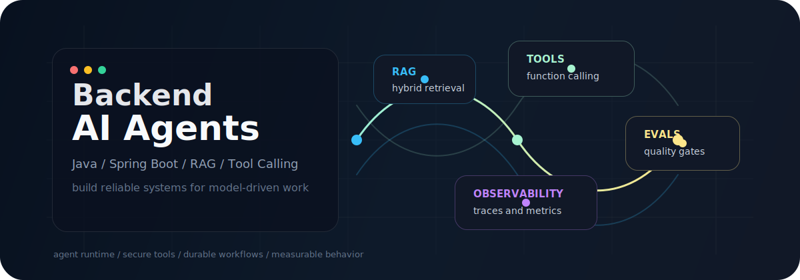

  

<h1 align="center">Hi, I'm Igor Bykowski</h1>
<h3 align="center">Software Engineer from Poland building backend systems and learning production AI agent engineering.</h3>

  
  
  

---

### What I build

<table>
  <tr>
    <td width="50%">
      <h3>Backend systems</h3>
      
Java and Spring Boot services with clean boundaries, SQL persistence, migrations, testing and cloud-native delivery.

    </td>
    <td width="50%">
      <h3>AI agent foundations</h3>
      
Agent workflows, tool calling, retrieval, evals and observability for model-powered applications that can be debugged and improved.

    </td>
  </tr>
</table>

### Current direction

- Building toward **AI agent engineering**: orchestrators, tools, memory, retrieval and human-in-the-loop flows.
- Designing **LLM-ready APIs**: structured inputs, typed outputs, recovery hints and safe execution boundaries.
- Learning production-grade **RAG**: embeddings, vector search, hybrid retrieval and dataset-driven evaluation.
- Keeping backend fundamentals sharp: **Java, Spring Boot, PostgreSQL, Docker, Kubernetes and AWS**.

### Stack

  

### AI engineering focus

  
  
  
  
  
  
  
  

### 2026+ skills I care about

| Area | What I practice |
| --- | --- |
| Agentic workflows | Orchestration, task state, tool design, retries and human approvals |
| Retrieval | RAG, embeddings, vector stores, hybrid search and context selection |
| Reliability | Evals, traces, regression datasets, observability and cost/latency control |
| Security | Prompt-injection awareness, sandboxing, permission boundaries and safe actions |
| Backend craft | Clean architecture, API contracts, SQL, tests, containers and cloud delivery |

### GitHub signal

  

  
  

  

